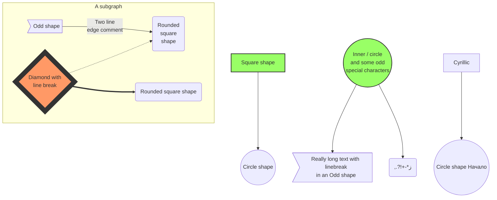

# Chapter 1 

The story begins here..

W> This is a warning
W> Callout that
W> That should be covered


This is a paragraph before the aside.

A> This is a paragraph in the aside.
A>
A> This is a
A> second paragraph in the aside
A> which contains newlines.
A>
A> This is a third paragraph in the aside.

This is a paragraph after the aside.

## More stuff happens here..

# Prequel

July 31, 2015 2:11 PM

This is prequel text.


[TOC]

* * *
_ _ _

## Welcome to MarkdownPad 2 ##

**MarkdownPad** is a full-featured Markdown editor for Windows.

### Built exclusively for Markdown ###

Paragraphs are separated by a blank line.

Enjoy first-class Markdown support with easy access to  Markdown syntax and convenient keyboard shortcuts.

++This could be underlined in multimarkdown++

Give them a try:

- **Bold** (`Ctrl+B`) and *Italic* (`Ctrl+I`)
- Quotes (`Ctrl+Q`)
- Code blocks (`Ctrl+K`)
- Headings 1, 2, 3 (`Ctrl+1`, `Ctrl+2`, `Ctrl+3`)
- Lists (`Ctrl+U` and `Ctrl+Shift+O`)

# This is an h1 tag

An h1 header
============

An h2 header
------------

## This is an h2 tag
###### This is an h6 tag

## Emphasis

*This text will be italic*
_This will also be italic_

**This text will be bold**
__This will also be bold__

*You **can** combine them*
Lists

## Unordered

* Item 1
* Item 2
  * Item 2a
  * Item 2b

## Ordered

1. Item 1
2. Item 2
3. Item 3
   * Item 3a
   * Item 3b

## Github online syntax highlighting

```ruby
1+1
@this.function(1)
a = Shoo::Foo
```

## Extra's code blocking

### Smash lines

``````````````````
another code block
more data here
``````````````````

### \<pre\> the lines
~~~

blank line before
blank line after

~~~

~~~
blank line before
blank line after
~~~

## See your changes instantly with LivePreview ###

Don't guess if your [hyperlink syntax](http://markdownpad.com) is correct; LivePreview will show you exactly what your document looks like every time you press a key.

### Make it your own ###

Fonts, color schemes, layouts and stylesheets are all 100% customizable so you can turn MarkdownPad into your perfect editor. <sup>1</sup>

Sup^superscript^, Sub~subscript~

### A robust editor for advanced Markdown users ###

MarkdownPad supports multiple Markdown processing engines, including standard Markdown, Markdown Extra (with Table support) and GitHub Flavored Markdown.

With a tabbed document interface, PDF export, a built-in image uploader, session management, spell check, auto-save, syntax highlighting and a built-in CSS management interface, there's no limit to what you can do with MarkdownPad.

## Tables

First Header  | Second Header
------------- | -------------
Content Cell  | Content Cell
Content Cell  | Content Cell

| First Header  | Second Header |
| ------------- | ------------- |
| Second Table Cell  | Content Cell  |
| Content Cell  | Content Cell  |

| Function name | Description                    |
| ------------- | ------------------------------ |
| `help()`      | Display the help window.       |
| `destroy()`   | **Destroy your computer!**     |

## HTML tables cause a big page break

<table>
<thead>
<tr>
  <th>HTMLFirst Header</th>
  <th>Second Header</th>
</tr>
</thead>
<tbody>
<tr>
  <td>Content Cell</td>
  <td>Content Cell</td>
</tr>
<tr>
  <td>Content Cell</td>
  <td>Content Cell</td>
</tr>
</tbody>
</table>

## Pandoc Tables are rarely supported


The above is the caption for the table.) Pandoc also supports
multi-line tables:

--------  -----------------------
keyword   text
--------  -----------------------
red       Sunsets, apples, and
          other red or reddish
          things.

green     Leaves, grass, frogs
          and other things it's
          not easy being.
--------  -----------------------

* * *

## Graphs

* Flowchart
    * TB - top bottom
    * BT - bottom top
    * RL - right left
    * LR - left right
    * TD - same as TB
* Sequence Diagram
* Gantt Diagram


render mermaid  (only one per doc in 13.1)

https://github.com/knsv/mermaid

	npm install -g mermaid

```markdown
graph TD;
    A-->B;
    A-->C;
    B-->D;
    C-->E;
    C-->|Two|D[Better label];
```

```markdown
sequenceDiagram
    participant Alice
    participant Bob
    Alice->>John: Hello John, how are you?
    loop Healthcheck
        John->>John: Fight against hypochondria
    end
    Note right of John: Rational thoughts <br/>prevail...
    John-->>Alice: Great!
    John->>Bob: How about you?
    Bob-->>John: Jolly good!
```
* * *



## Definitions

Apple
:   Pomaceous fruit of plants of the genus Malus in 
    the family Rosaceae.

Orange
:   The fruit of an evergreen tree of the genus Citrus.

<dl>
<dt>Apple</dt>
<dd>Pomaceous fruit of plants of the genus Malus in 
the family Rosaceae.</dd>

<dt>Orange</dt>
<dd>The fruit of an evergreen tree of the genus Citrus.</dd>
</dl>

## Code Blocks

Term 2

:   This definition has a code block, a blockquote and a list.

        code block. :warning:

    > block quote
    > on two lines. :warning:

    1.  :warning: first list item
    2.  second list item 

## Inline

I think you should use an
`<addr>` element here instead.

## Block quotes

As Kanye West said:

> We're living the future so
> the present is our past.

## Using Foot Notes

That's some text with a footnote.[^1]

[^1]: And that's the footnote.

That's some text with a footnote. [^defa]

[^defa]: And that's the real automated footnote by markdown-extra.

## Cross out text

~~Mistaken text.~~

## Lists

- [x] tasklist
- [ ] foo


- [x] @mentions, #refs, [links](), **formatting**, and <del>tags</del> are supported
- [x] list syntax is required (any unordered or ordered list supported)
- [x] this is a complete item
- [ ] this is an incomplete item

## Math

Inline math equations go in like so but need to be at the end of line: $$$ \omega = d\phi / dt $$$ 

Display math should get its own line and be put in in double-dollarsigns:

$$I = \int \rho R^{2} dV$$

$$
1+1
$$

Inline can be in bullet/lists:

* $$$ I = \int \rho R^{2} dV $$$

### Other Macro lists should work but dont always render

- [x] foo 
- [ ] $$$ I = \int \rho R^{2} dV $$$
- [x] this is a complete item
- [ ] this is an incomplete item

### Code blocks stop math

	$$$ I = \int \rho R^{2} dV $$$

## Escaping

And note that you can backslash-escape any punctuation characters
which you wish to be displayed literally, ex.: \`foo\`, \*bar\*, etc.

## Github Issues

* SHA: a5c3785ed8d6a35868bc169f07e40e889087fd2e
* User@SHA: jlord@a5c3785ed8d6a35868bc169f07e40e889087fd2e
* User/Repository@SHA: jlord/sheetsee.js@a5c3785ed8d6a35868bc169f07e40e889087fd2e
* #Num: #26
* GH-Num: GH-26
* User#Num: jlord#26
* User/Repository#Num: jlord/sheetsee.js#26

## Emoji

http://www.emoji-cheat-sheet.com/

:v: :sparkling_heart: :boom: :arrow_forward: :information_source: :repeat: :warning: :no_entry_sign: :id: :clock10:
:interrobang: :closed_lock_with_key: :calendar: :clipboard: :notebook: :-1: :+1: :package:

```
:warning: Does this do code fencing?
```

~~~
:warning: Does this do code fencing?
~~~


## Images

### Funky stuff on markdownpad2

* Images online don't export to pdf.


* Use a file location doesn't preview but will pdf export.

### Haroopad


<!-- This is a comment -->

This is a ==highlighted area==.

## Hand Ftnotes

These have to be here by hand.

[1] `CCSA - http://commons.wikimedia.org/wiki/File:Germantown_Commissary,_BBQ_Pork_Sandwich.jpg`

